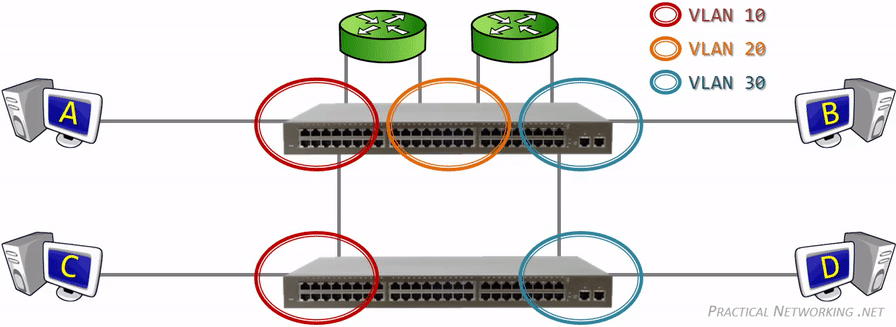
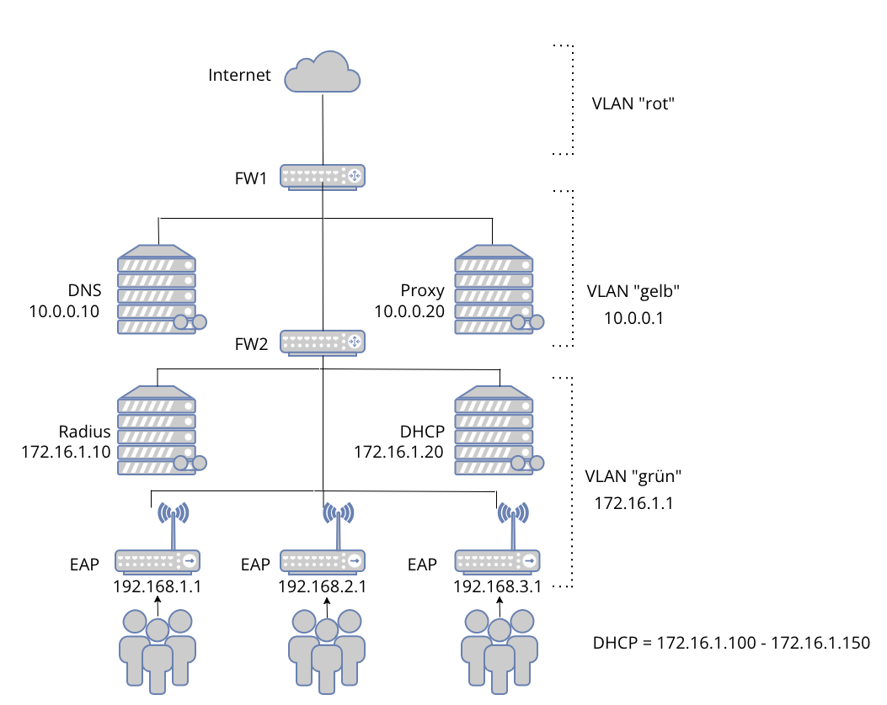
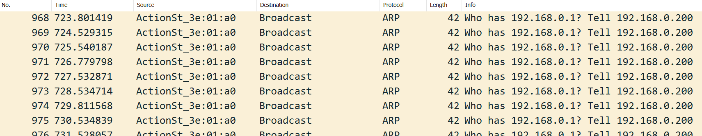
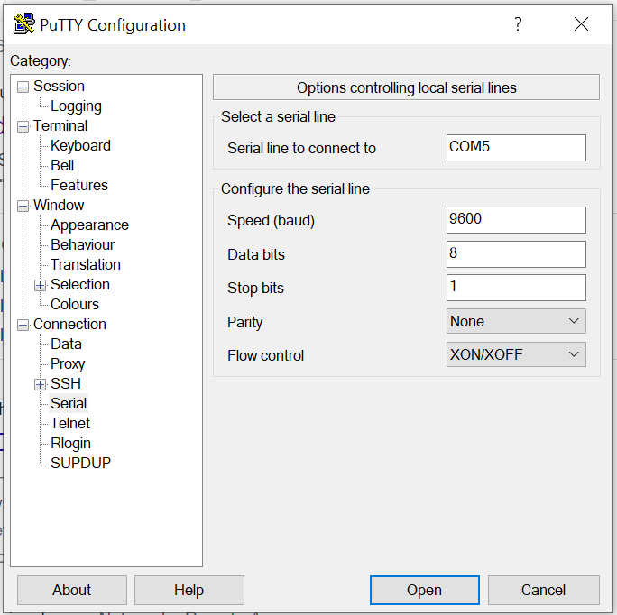

# Aufgabe Netzwerktechnik - VLAN Monitoring 

## Einleitung

Am Freitag, 21. Januar 2022 fand das Praktikum im Fach Netzwerktechnik bei Andreas Holzer statt. Der Inhalt des Praktikums war es, unser Wissen im Bereich der Netzwerktechnik zu vertiefen.

Die Aufgabenstellung für diesen Morgen lautete folgendermassen: Wir sollten einen Switch einrichten und darauf VLANs konfigurieren. Die Hardware dazu wurde uns zur Verfügung gestellt und wir erhielten von Andreas eine Grafik, aus der wir die Konfiguration des ganzen Netzwerkes entnehmen konnten. Diese Grafik war für uns insofern wichtig, da das VLAN das Grundgerüst des Netzwerks darstellte.

Während des Praktikums dokumentierten wir alle Arbeitsschritte, Überlegungen und Ideen. Aus diesen Inhalten erstellten wir anschliessend diese Anleitung auf Github.

## Übersicht

### Funktionsweise eines VLAN
Vorab informierten wir uns über die Funktionsweise eines VLAN, um die Aufgabe in Angriff nehmen zu können. Nach erfolgter Recherche bei Wikipedia halten wir folgen fest:

- Ein Virtual Local Area Network (VLAN) ist ein logisches Teilnetz (Segment) innerhalb eines Switches bzw. eines gesamten physischen Netzwerks. 
- Ein VLAN kann sich über mehrere Switches hinweg ausdehnen. 
- Ein VLAN trennt physische Netze in Teilnetze auf, indem es dafür sorgt, dass VLAN-fähige Switches Frames (Datenpakete) nicht in ein anderes VLAN weiterleiten, obwohl die Teilnetze an gemeinsamen Switches angeschlossen sein können.

Die Zuordnung der Teilnetze zu einem VLAN kann statisch über Portzuordnung an den Switches erfolgen, über spezielle Markierungen an den Paketen (Tags) realisiert sein oder dynamisch geschehen (zum Beispiel durch MAC-Adressen, IP-Adressen bis hin zu TCP- und UDP-Ports und höheren Protokollen). Ebenfalls ist eine Zuordnung eines Ports zu einem VLAN nach Authentifizierung des Anwenders z. B. mittels 802.1X möglich.

Jedes VLAN bildet, wie ein normales, physisch separiertes Netzwerksegment, eine eigene Broadcast-Domäne. Um den Verkehr zwischen den VLANs transparent zu vermitteln, wird ein Router benötigt. Moderne Switches stellen diese Funktion intern zur Verfügung; man spricht dann von einem Layer-3-Switch.

Ein VLAN bietet diverse Vorteile im Gegensatz zum herkömmlichen Ansatz:

- Die Zuordnung von Endgeräten zu Netzwerksegmenten erfolgt unabhängig vom Standort der Basisstation.
- Im gegensatz zur physischen Zuordnung zu verschiedenen Subnetzenm kann der Wechsel eines Clients von einem VLAN in ein anderes am Kopplungselement (Multilayerswitch, Router) geschehen, ohne dass eine physische Verbindung geändert werden muss.
- Es Entstehen Performance-Vorteile. So kann zum Beispiel ein bestimmter Datenverkehr wie VoIP in einem VLAN erfolgen, das bei der Übertragung priorisiert wird.
- VLANs können Netze gegen Ausspionieren und Abhören besser absichern als Switch-basierte Netze. 

Die folgende Grafik veranschualicht den Aufbau eines VLAN:

Abb. 1: Funktionsweise eines VLAN

### Aufgabenstellung

Abb. 2: Konfiguration des Netzwerkes

Auf der schematischen Darstellung von Andreas ist ersichtlich, dass drei VLANs benötigt werden:

- VLAN "rot" bildet die öffentliche Zone (DMZ). Diese ist nicht durch eine Firewall geschützt, die Geräte sind direkt am Netz. Das VLAN bildet die Schnittstelle zum Internet.
- VLAN "gelb" befindet sich hinter der ersten Firewall. Hier liegt der DNS- und der Proxy-Server.
- VLAN "grün" befindet sich hinter der zweiten Firewall und bildet das interne Netz. Hier liegt der DHCP-Server, der Radius-Server sowie die Access Points, welche die Funktion "EAP" unterstützen. 

## Dokumentation der Installation / Konfiguration / Testing

Da wir verschiedene Ansätze geprüft haben, werden wir die einzelnen Herangehensweisen direkt beschreiben und jeweils auf die Installation, Konfiguration und das Testing jedes Ansatzes eingehen.

### 1. Versuch: Netgear Switch GS728TP
Manual: [Dokumentation für den Netgear Switch](doc/Manual_Netgear_Switch.pdf)

- Netgear Switch mittels Factory Reset auf Werkeinstellungen zurückgesetzt
- Versucht mittels NDST Tool via Layer2 Pakete auf Switch zuzugreifen. Nicht erfolgreich, es wurden keine Geräte gefunden.
- Versucht mit statischer IP-Adresskonfiguration gemäss Handbuch auf den Switch zuzugreifen.
- Mit Wireshark geprüft, ob der Switch reagiert. Nicht erfolgreich, der Switch sendet auf mehreren Ports keine Antwort.
- Feststellung, dass der Netgear-Switch nicht funktioniert. In Absprache mit Andreas wechseln wir auf den HP Switch ProCurve 2510G-58.

Abb. 3: Auszug aus Wireshark, Switch sendet keine Antwort

### 2. Versuch: HP Switch ProCurve 2510G-58
Manual: [Dokumentation für den HP Switch](doc/Manual_HP_Switch.pdf)

- HP Switch mittels Factory Reset auf Werkeinstellungen zurückgesetzt
- Verwendung eines RJ45 to Serial Kabel um eine Verbindung herzustellen.
- Spezieller Treiber für die Verwendung dieses Kabels hat nicht funktioniert. Es kann keine Verbindung mit PuTTY aufgebaut werden.
- Mit Unterstützung eines Mitschülers werden Treiberkonflikte mit von Windows vorinstallierten Treibern festgestellt. Es kann kein Treiber installiert werden, da das Betriebssystem (Windows) den aktuellen Treiber nicht überschreiben lässt.
- Zugriff auf serielle Konsole funktioniert nicht, da PuTTY nicht reagiert. Beim Klick auf den Button "Open" passiert nichts

Abb. 4: Ausschnitt aus dem Konfigurationstool PuTTY

### 3. Versuch: Cisco Switch
Manual: [Dokumentation für den Cisco Switch](doc/Manual_Cisco_Switch.pdf)

- Kommunikation mit dem Switch erfolgreich.
- Grundlegende Konfiguration konnte abgeschlossen werden
- Weiterarbeit nicht möglich: Es blieb keine Zeit mehr für das Studium und die Umsetzung der Befehle (Cisco iOS)

## Testing
Das Testing entfällt, da wir keinen der drei Switches in Betrieb nehmen konnten.

## Ausblick
Wäre uns mehr Zeit zur Verfügung gestanden, hätten wir uns vertiefter mit der Materie auseinandersetzen können. Das Ziel wäre es gewesen, die VLANs zum Laufen zu bringen. Da das VLAN das Grundgerüst des Netzwerkschemas bildet, konnten wir das ganze Netzwerk nicht zum Laufen bringen.

Als Nächstes hätten wir die Konfiguration des Cisco-Switches beendet. Leider hätten wir dafür viel mehr Zeit benötigt, da wir uns überhaupt nicht mit dem Cisco iOS auskannten und so die Einarbeitungszeit sehr hoch gewesen wäre.

## Glossar
Worterklärungen finden sich im [Glossar](doc/glossar.md)
